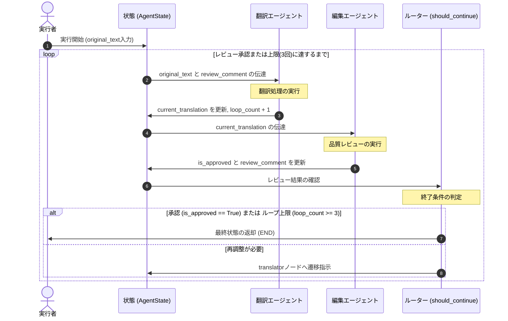

# LangGraph で学ぶマルチエージェント構築：ループと状態管理の実装入門

## 1. 導入 (WHY)
LLM（大規模言語モデル）の進化により、自律的にタスクを実行する「AIエージェント」の活用が急速に進んでいます。

前回の記事「[エージェントごとにAIモデルを切り替える具体例](.column-multi_agent_model_selection.md)」では、設定ファイル（指示書）ベースでのモデル切り替えルールを紹介しました。

本記事ではその実践編として、**「実際にPythonコードを書き、ループや状態管理を伴うマルチエージェントを構築する手法」**を解説します。

特に、コードベースの開発で直面しがちな以下の悩みを解決します。

- **「複雑な分岐やループ処理をスマートに制御したい」**
- **「エージェント間の状態（State）管理が複雑化するのを防ぎたい」**
- **「LangGraph の具体的な実装方法やメリットを知りたい」**

本記事では、 **「LangGraph」** を題材に、シンプルな「翻訳＆編集ループ型マルチエージェント」を短時間で構築するハンズオンをお届けします。

LangGraphの状態管理を体験し、自律エージェント実装の基礎を押さえましょう。

---

## 2. 本論 (WHAT & HOW)

### なぜLangGraphなのか？従来のLangChainとの違いと0.4系の位置づけ
LangChainは、あらかじめ決められた手順（パイプライン）に沿って処理を流すチェーンの構築で広く使われてきました。

一方、現実の業務フローでは「LLMが生成した結果を人間や別のAIがレビューし、問題があれば修正して再実行する」といった「繰り返し（ループ）」や「柔軟な条件分岐」を明示的に扱いたい場面があります。

LangGraph は、このような「ループを伴うステートフルなグラフ構造」をシンプルかつ強力に定義できるフレームワークです。`StateGraph`、`START` / `END`、チェックポインタ、実行時 `config` などを組み合わせることで、状態を持つLLMワークフローを実装できます。

> 💡 **用語解説: LangGraph**
> 複雑なLLMアプリを、点（ノード）と線（エッジ）のグラフ構造で直感的に定義・実装できるライブラリです。

> 💡 **用語解説: 状態（State）**
> グラフ内のすべての処理（ノード）で共有されるデータの一元管理オブジェクトです。会話履歴や処理プロセスの一時変数などを安全に保持します。

LangGraphを使うと、ノード、エッジ、状態を分けて定義できるため、ループや条件分岐を含むLLMアプリの流れを見通しよく表現できます。

---

### LangGraph によるマルチエージェント実装ハンズオン
それでは、実際にPythonを使用してマルチエージェントを構築してみましょう。

今回は、 **翻訳と編集（品質レビュー）を承認されるまで自動で繰り返す「翻訳エージェント（Translator）」**と **「編集エージェント（Reviewer）」**が協調するループ型のワークフローを作成します。

全体の処理の流れは、以下のシーケンス図のようになります。



> 💡 **用語解説: マルチエージェント**
> 異なる役割を持つ複数のAIエージェントが連携し、複雑な課題を共同で解決する仕組みのことです。

#### 1. セットアップ
開発環境を汚さないよう、Pythonの仮想環境（`venv`）を作成して実行します。

```bash
# 仮想環境の作成と有効化
python -m venv .venv
source .venv/bin/activate     # macOS/Linuxの場合
# Windowsの場合は以下を実行します:
# .venv\Scripts\activate

# 必要なライブラリのインストール
pip install langgraph==0.4.10 langchain-google-genai==4.2.6 python-dotenv==1.0.1
```

次に、プロジェクトのルートディレクトリに `.env` ファイルを作成し、APIキーを定義します。

セキュリティ確保のため、本物のAPIキーは決してハードコードせず、必ず環境変数から読み込むようにしましょう。
```env
GOOGLE_API_KEY=[YOUR_GOOGLE_API_KEY]
```

#### 2. 実装コード (`main.py`)
完全な実装コードは、別ファイル [main.py](./sample/blog-learning-langgraph-multi-agent/main.py) を参照してください。

グラフの構築（StateGraph）、ノード（translator_node, reviewer_node）、条件付きエッジ（should_continue）の具体的な接続方法などが記述されています。

#### 3. 期待される実行ログ
スクリプトを実行すると、コンソールに以下のような流れが出力されます。

レビュワーはレビュー本文を表示せず、`APPROVED` または `DENIED` のみを出力します。

ルーターはその結果をチェックして、終了するか次の翻訳ループに戻すかを判断します。

```text
(.venv) % python main.py

--- [Translator] 翻訳中... ---
--- [Reviewer] レビュー中... ---
--- [Review Result: Loop 1] ---
DENIED
--- [Router] 再調整が必要です。次のループへ進みます。(回数: 1/3) ---

--- [Translator] 翻訳中... ---
--- [Reviewer] レビュー中... ---
--- [Review Result: Loop 2] ---
APPROVED
--- [Router] レビュー承認: 終了します。 ---

==================================
model: gemini-3.1-flash-lite
thread_id: translation-review-demo
元文章: 昨日は遅くまで開発をしていましたが、LangGraphのおかげで作業がスムーズに進みました！
最終翻訳結果: ご提示いただいた修正指示と改善案の意図を汲み取り、プロフェッショナルかつ自然な英語として、以下の通り最終案を提示いたします。

**最終翻訳案:**
> **I was working late on development yesterday, but LangGraph really helped streamline the workflow.**

---
**解説:**
ご指摘の通り、`streamline the workflow` を使用することで、単に「作業が滞らなかった」という事実だけでなく、「ツールが効率化に貢献した」というポジティブな評価が明確に伝わります。また、`I was working late` とすることで、昨晩の状況が目に浮かぶような自然な文脈となり、ビジネスチャットや報告の場において非常に洗練された印象を与えます。
ループ総回数: 2
==================================
```

---

### プロダクション運用への第一歩：状態の永続化とセキュリティ設計

実際に本番環境でマルチエージェントを運用する際は、まず以下の2点を設計に取り入れると、より安全に運用できます。

- **会話履歴の永続化（スレッド管理）**:
  LangGraph では、`InMemorySaver`（インメモリ）などの「Checkpointer（チェックポインタ）」をコンパイル時に渡すことで、スレッド単位のグラフ状態を保存・復元できます。
  
  これにより、`thread_id` をキーにした、マルチターン対話の継続や状態の復元を実装しやすくなります。
  
  上記のハンズオンコードにおけるコンパイル（`app = workflow.compile()`）と実行部分を、以下のように差し替えることで、簡単に永続化を統合できます。

```python
from langgraph.checkpoint.memory import InMemorySaver

# インメモリによる会話状態の保存先を初期化します
memory = InMemorySaver()

# グラフをコンパイルする際にチェックポインタを指定します
app = workflow.compile(checkpointer=memory)

# 実行時はスレッドIDや再帰上限などの設定情報（config）を渡します
config = {
    "configurable": {"thread_id": "translation-review-demo"},
    "recursion_limit": 10,
}
final_state = app.invoke(input_data, config=config)
```

- **無限ループとAPIコストの制御**:
 LLMエージェントが指示の矛盾等から終わりのない修正ループに突入すると、多大なAPIコストが発生してしまいます。
  
  上記のサンプルで実装したループ回数制限に加え、LangGraphの `recursion_limit` を実行時の `config` で適切に設定し、予期せぬ挙動を未然に防ぐ防御的な設計を取り入れましょう。


#### コラム: 状態の永続化とコンテキストの蓄積ルール
<details>
<summary>「スレッド管理を有効にすれば、会話の全履歴（コンテキスト）が自動的にLLMへ引き継がれるのか？」という詳細な挙動と実運用上の注意点はこちらをクリックして展開</summary>

結論から言うと、これは **State（状態オブジェクト）の定義の仕方** に依存します。

1. **messages フィールドを追加ルールにする場合**:
   `Annotated[list, add_messages]` のように reducer を指定したメッセージリストを State に持たせると、新しい会話が上書きされずにリスト末尾に自動で蓄積されます。スレッドを再開した際、これまでの全コンテキストがLLMに渡されます。
2. **通常のデータ型（上書き）にする場合**:
   本稿のサンプルのように、`current_translation: str` などのフィールドに単に新しい文字列を返す場合は、チェックポインタには「最新の値」のみが上書き保存され、古い履歴はLLMへ渡されません。

全会話履歴を蓄積する設計（上記1）にする場合、会話が長くなるとLLMのコンテキスト制限（トークン上限）に達し、APIコストも急増します。そのため、直近N件の会話のみにトリミングする（`trim_messages` の利用など）、あるいは「過去の会話を要約するノード」をグラフ内に組み込み、State を適度に圧縮しながら持ち回る設計が現実的です。
</details>


#### コラム: ループのその先へ — エージェントの「成長（知見の蓄積）」はどう設計すべきか？
<details>
<summary>「一時的なエラー修正」から「永続的なシステムの成長」へとエージェントの知見を蓄積する4つの設計レベルはこちらをクリックして展開</summary>

今回のハンズオンでは「レビューが承認されるまで修正ループを回す」手法を構築しました。しかし、実運用では「毎回同じ指摘をレビューで受けるのではなく、実行を重ねることでエージェントの振る舞いを継続的に改善する仕組み」が欲しくなります。

エージェントに過去の知見を反映し、継続的に改善するための代表的なアプローチは以下の通りです。

1. **外部フィードバックの動的ロード**:
   人間やレビュワーAIからの指摘（ルール）を外部ファイルやDBに蓄積し、次回実行時にシステムプロンプトへ Few-Shot（挙動例）として動的にロードします（※本ブログのリポジトリ管理がまさにこの手法を体現しています）。
2. **自己内省（Self-Reflection）による指示書の自己アップデート**:
   実行失敗ログや指摘データを基に、エージェント自身（または内省用エージェント）に原因を分析させ、自身が持つシステムプロンプトのルール定義ファイルをプログラム的に自己書き換えして保存します。
3. **長期記憶（Long-term Memory）のRAG化**:
   過去の「課題と成功した解決コード」のペアをベクトルデータベースに保存し、類似のタスクが実行された際に動的にプロンプトに挿入して解決能力を底上げします。
4. **継続的ファインチューニング**:
   蓄積された大量の成功・失敗の運用ログをデータセット化し、定期的にモデル自体をファインチューニングすることで、エージェントの応答品質を継続的に改善します。

「一時的なエラー修正のループ」から「永続的なシステムの成長」へと設計を進めることで、より実用的なマルチエージェントシステムへ発展させることができます。
</details>

---

## 3. まとめ (NEXT STEP)
本記事では、LangGraph のコンセプトと、翻訳＆レビューエージェントによるループ型マルチエージェント構築の基本を解説しました。

グラフとしてLLMの処理の流れを定義できるため、複雑になりがちなエージェントのロジックを、比較的見通しよく表現できることが分かります。

次のステップとして、ぜひ以下の公式ドキュメントやリソースを参考に、さらに一歩踏み込んでみてください！
- **[LangGraph Official Documentation](https://docs.langchain.com/oss/python/langgraph/overview)**: 公式の最新のチュートリアルやAPIの仕様が豊富に記載されています。
- **本番開発時の注意**: LangGraphは継続的に更新されているため、新しく本番システムを立ち上げる際は、利用時点の公式ドキュメントで推奨されている安定版を確認して使用してください。

ぜひ手元の環境でコードを動かして、マルチエージェント開発の流れを体験してみてください。
